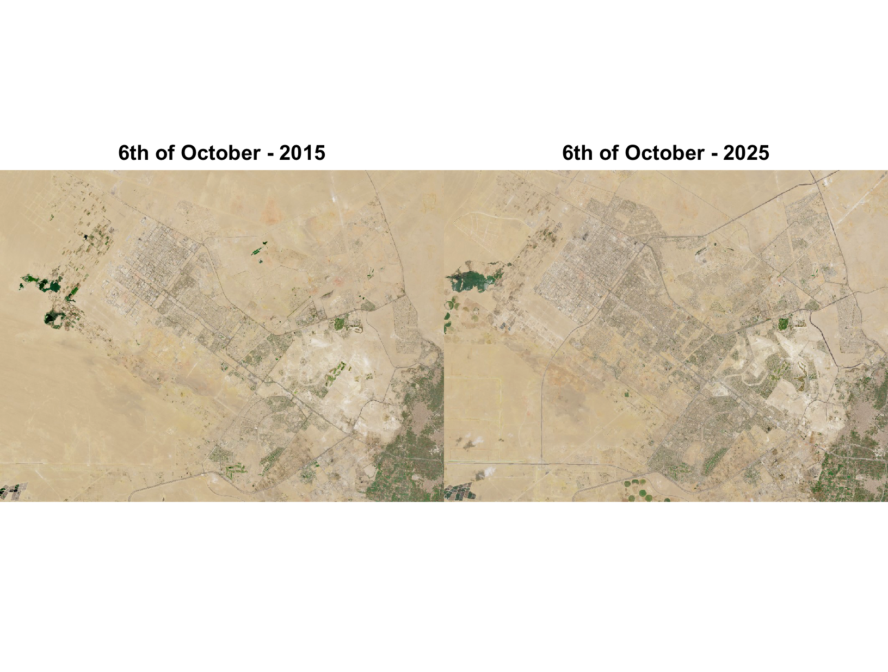

# Monitoring Urban Expansion in 6th of October City (2015 - 2025)

## Exam for spatial Ecology in R

#### **Supervisor:** Prof. Duccio Rocchini

**Student:** Mohamed Abdelgaber

# Introduction

6th of October City in Egypt has undergone massive urban transformations over the last decade. This study aims to utilize Remote Sensing techniques to analyze land cover changes, specifically the conversion of desert areas into residential and industrial zones.


**Data Sources:**

-   **Baseline**: Satellite imagery of 6th of October City from October 2015.
-   **Comparison**: Satellite imagery of the same area from October 2025.

# Methodology & Tools

The analysis was performed using the `terra` package for raster data manipulation, `imageRy` for image classification, and `ggplot2` for statistical visualization.

### Environment Setup & Libraries

```         
library(terra) # Data manipulation
library(imageRy) # Image classification 
library(ggplot2) # Data visualization
```

### Set working directory

```         
setwd("~/Desktop/r-project/exam/")
```

### Data Import & Visual Inspection

```         
m2015 <- rast("oct_2015.jpg")
m2025 <- rast("oct_2025.jpg")

# Visual comparison of original images
par(mfrow=c(1,2))
plot(m2015, main="6th of October - 2015")
plot(m2025, main="6th of October - 2025")
```

{width="699"}

# Land Cover Classification

We applied an **Unsupervised Classification** algorithm to categorize the images into two main clusters: **Desert** and **Urban**.

```         
# Classifying images into 2 clusters
m2015c <- im.classify(m2015, num_clusters=2)
m2025c <- im.classify(m2025, num_clusters=2)

# Plotting the classified maps
par(mfrow=c(1,2))
plot(m2015c, main="Classes in 2015")
plot(m2025c, main="Classes in 2025")
```

 

# Statistical Analysis of Growth

We calculated the frequency of pixels to determine the percentage of land cover for each class.

```         
# Calculate pixel frequencies and percentages for 2015
f2015 <- freq(m2015c)
tot2015 <- ncell(m2015c)
perc2015 <- f2015$count * 100 / tot2015

# Calculate pixel frequencies and percentages for 2025
f2025 <- freq(m2025c)
tot2025 <- ncell(m2025c)
perc2025 <- f2025$count * 100 / tot2025

# Print the percentage results to the console
print("Percentages in 2015:")
print(perc2015)

print("Percentages in 2025:")
print(perc2025)
```

|        | 2015 Percentage | 2025 Percentage |
|--------|-----------------|-----------------|
| Desert | `90.6%`         | `85.3%`         |
| Urban  | `9.4%`          | `14.7%`         |

### Graphical Representation

```         
data <- data.frame(
  Year = factor(c("2015", "2015", "2025", "2025")),
  Class = c("Desert", "Urban", "Desert", "Urban"),
  Percentage = c(90.6, 9.4, 85.3, 14.7)
)

ggplot(data, aes(x=Year, y=Percentage, fill=Class)) +
  geom_bar(stat="identity", position="dodge") +
  scale_fill_manual(values=c("khaki", "brown")) + 
  labs(title="Urban Expansion: 2015 vs 2025", y="Land Cover %") +
  theme_minimal()
```


# Change Detection Map

By subtracting the 2015 classified map from the 2025 map, we can pinpoint the exact locations where desert was converted into urban land.

```         
# Function to make classes consistent: 
# It ensures Class 1 is always the majority (Desert) and Class 2 is Urban
standardize_map <- function(classified_img) {
  freqs <- freq(classified_img)
  # Find which value (1 or 2) is the majority
  majority_val <- freqs[which.max(freqs$count), "value"]
  
  # If the majority is value 2, we swap 1 and 2
  if(majority_val == 2) {
    r_new <- classified_img
    r_new[classified_img == 1] <- 20 # Temporary value
    r_new[classified_img == 2] <- 10 # Switch 2 to 10
    
    r_final <- r_new
    r_final[r_new == 10] <- 1 # Set Desert to 1
    r_final[r_new == 20] <- 2 # Set Urban to 2
    return(r_final)
  } else {
    return(classified_img) # Already correct
  }
}
```

```         
m2015_fixed <- standardize_map(m2015c)
m2025_fixed <- standardize_map(m2025c)

# Calculating the difference
change_map <- m2025_fixed - m2015_fixed

# Plotting the Change Detection Map
par(mfrow=c(1,1))
my_colors <- c("red", "gray90", "blue")
plot(change_map, col=my_colors, legend=FALSE, main="6th of October Urban Growth Detection")

legend("topright",
       legend = c("New Urban Areas", "No Change", "Loss/Change"),
       fill = c("blue", "gray90", "red"),
       bty    = "o", bg = "white", cex = 1)
```

{width="753"}

**Map Interpretation:**

-   **Blue:** Represents new urban developments (Growth).

-   **Light Gray:** Represents areas with no significant land cover change.

-   **Red:** Red pixels may indicate conversion from urban to non-urban, but in practice they often reflect misclassification or local changes in surface reflectance between dates.

# Conclusion

The analysis demonstrates a significant urban sprawl in 6th of October City, showing a **5.3% increase** in built-up areas relative to the total study site over the decade. This data-driven approach highlights the speed of development and provides essential insights for sustainable urban planning.

# References

-   European Union, Copernicus Sentinel-2 imagery (2015-2025). Retrieved from [Copernicus Data Space Ecosystem](https://dataspace.copernicus.eu/).

-   **Rocchini, D. (2025)***: Educational tools for satellite image processing*. Developed at the University of Bologna.

-   **R Core Team (2026).** *R: A Language and Environment for Statistical Computing*. R Foundation for Statistical Computing, Vienna, Austria.

-   **Wickham, H. (2016).** *ggplot2: Elegant Graphics for Data Analysis*. Springer-Verlag New York.
